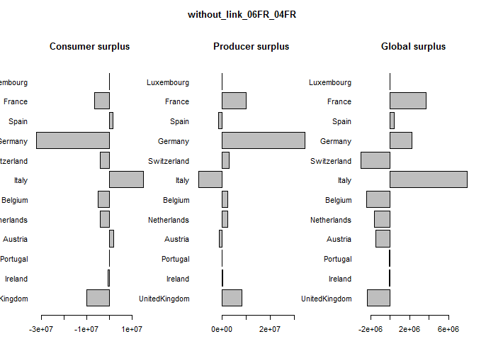
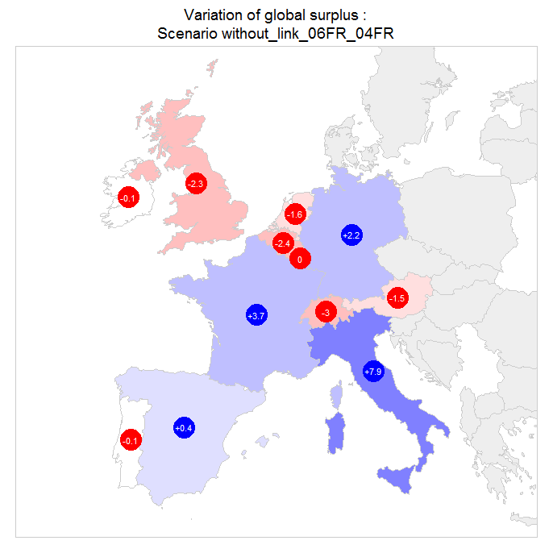

The `antaresProcessing` package provides functions that uses data created with package `antaresRead` to compute standard aggregate like customer surplus or sector surplus. This document demonstrates how to use the main functions of the package.

## Installation

The `antaresProcessing` package can be installed from zip file. Its installation requires that the `antaresRead` package has already been installed. If it is not already the case, you can use the following commands.

```r
install.packages(c("data.table", "plyr", "lubridate"))
install.packages("path/to/package/antaresRead_***.zip")
```

In all cases, run:

```r
install.packages("path/to/package/antaresProcessing_***.zip")
```

## Basic usage

The usage of the package is quite straightforward. First one has to read data from an antares study with `readAntares` and then pass it to a function of `antaresProcessing`. Each function requires different type of data (areas, links...) and different level of detail. Generally, functions that perform non-linear calculations require hourly data for each Monte-Carlo scenario but they have arguments to then aggregate the results at the desired level of detail. On the contrary, functions that do linear calculations accept every level of detail and their output has the same level of detail as their input.

The following table sums up the required data and the output of the different functions. For more details, one can look at the help file of each function. Especially, each help page contains an example that minimizes the amount of data read. 

Function        | Description | requires |time step | works on synthesis
----------------|-------------|:--------:|:--------:|:-----------------:
surplus         | Consumer and producer surplus | areas, links | hourly | no
surplusClusters | Surplus of clusters | clusters, areas | hourly | no
surplusSectors  | Surplus of sectors of production | areas, clusters | hourly | no
addNetLoad      | Net load | areas and/or districts | all | yes
netLoadRamp     | Ramp of net load | areas and/or districts | hourly | no
margins         | Downward and upward margins of an area    | areas, clusters | all | yes
modulation      | modulation of cluster units or sectors | areas or districts or clusters | all | yes

There is also a `compare` function that can be used to compare two tables with same shape. It is useful to compare the results of two simulations. 

```r
studyPath <- "path/to/study"

setSimulationPath(studyPath, 1)
data1 <- readAntares(areas = "all", links = "all", synthesis = FALSE)
surplus1 <- surplus(data1,  timeStep = "annual", synthesis = TRUE) 

setSimulationPath(studyPath, 2)
data2 <- readAntares(areas = "all", links = "all", synthesis = FALSE)
surplus2 <- surplus(data2,  timeStep = "annual", synthesis = TRUE)

compare(surplus1, surplus2)

## 'antaresDataTable' object with dimension 72 x 8
## Type: surplusComparison
## TimeStep: annual
## Synthesis: TRUE
##                area timeId time consumerSurplus producerSurplus storageSurplus ...
## 1:            01_pt Annual 2017       -57046.01       10371.915              0
## 2:            02_es Annual 2017      -956371.65      517675.155              0
## 3:            03_es Annual 2017      2435946.66    -1978004.005              0
## 4:            04_fr Annual 2017       -70700.07      110701.300              0
## ...

```

By default, `compare` computes the difference between two tables, but it can also compute a ratio or a variation rate.

## Use case: Differences of global surpluses in different scenarios  

In this use case, we use a study that represents the european with 72 areas and 119 links. Districts have been set up to group nodes belongins to the same country. 4 simulations have been conducted. The first one correspond to refence scenario and the 3 others are scenarios were different investments have been performed.


We want to see how the investments made in each scenario modify the surplus of the main countries of the study.

First of all, we compute the surplus in the reference scenario. The study contains production virtual nodes. They are easy to identify: their names ends with `offshore`. We remove them with the function `removeVirtualAreas`.

```r
studyPath <- "path/to/study"

setSimulationPath(studyPath, 1)
dataRef <- readAntares(areas = "all", links = "all", synthesis = FALSE)
dataRef <- removeVirtualAreas(dataRef, production = getAreas("offshore"))

surplusRef <- surplus(dataRef,  timeStep = "annual", synthesis = TRUE,
                      groupByDistrict = TRUE) 
                      
surplusRef

## 'antaresDataTable' object with dimension 12 x 8
## Type: surplus
## TimeStep: annual
## Synthesis: TRUE
##          district timeId time consumerSurplus producerSurplus storageSurplus ...
##  1: UnitedKingdom Annual 2017     69777551575       708862676              0
##  2:       Ireland Annual 2017      6132070496        48561453              0
##  3:      Portugal Annual 2017     11863914450       145133055              0
##  4:       Austria Annual 2017     14863660681       222890871              0
##  5:   Netherlands Annual 2017     26234259031       122350301              0
## ...
```

We do the same for the three other simulations. We use `lapply` to loop over simulations and create a list containing the surpluses of each simulation.

```r
surpluses <- lapply(2:4, function(n) {
  setSimulationPath(studyPath, n)
  data <- readAntares(areas = "all", links = "all", synthesis = FALSE)
  data <- removeVirtualAreas(data, production = getAreas("offshore"))

  surplus(data,  timeStep = "annual", synthesis = TRUE, groupByDistrict = TRUE) 
})
```

We extract the name of the different simulations with the function `simOptions`

```r
simNames <- sapply(surpluses, function(x) {simOptions(x)$name})
names(surpluses) <- simNames
```

Now we can compute the difference of surplus between a given scenario and the reference scenario and visualize the difference:

```
simulation <- simNames[1]

comp <- compare(surplusRef, surpluses[[simulation]])
comp

## 'antaresDataTable' object with dimension 12 x 8
## Type: surplusComparison
## TimeStep: annual
## Synthesis: TRUE
##          district timeId time consumerSurplus producerSurplus storageSurplus ...
##  1: UnitedKingdom Annual 2017     -9905372.16      8215089.53              0
##  2:       Ireland Annual 2017      -490791.94       451606.36              0
##  3:      Portugal Annual 2017       -57046.01        10371.91              0
##  4:       Austria Annual 2017      1737701.42      -914903.58              0
##  5:   Netherlands Annual 2017     -4032251.26      2364236.84              0
## ...

par(mfrow = c(1, 3), las = 1, oma = c(0, 0, 3, 0))
barplot(comp$consumerSurplus, names.arg = comp$district, horiz = TRUE, main = "Consumer surplus")
barplot(comp$producerSurplus, names.arg = comp$district, horiz = TRUE, main = "Producer surplus")
barplot(comp$globalSurplus, names.arg = comp$district, horiz = TRUE, main = "Global surplus")
title(sim, outer = TRUE)
```


With a bit more work, one can create a function that require the name of a simulation and create a pretty version of the plot above (code in annex):

```r
plotDiffSurplus(simNames[1])
```


The figure shows that the variation of the surplus is quite limited. In most countries of the study, we observe of surplus from the consumers to the producers. This transfer is especially important in Germany. Italy is the only country where we observe a substantial transfer of surplus from the producers to the consumers.

Is is also relatively easy to create a map representing the same data with additional packages like `rgdal`:

```r
library(rgdal)
countries <- readOGR("countries/MyEurope.shp", layer = "MyEurope")
countries$district <- countries$CNTRY_NAME

# Function definition in annex
plotMapWithSurplus(simNames[1], countries)
```



## Annex

```r
# Function that maps numeric variable to colors
#
# Args:
# - x:       numeric vector
# - n:       approximate number of colors to use in the color scale
# - domain:  range of possible values x could take
# - negCol:  color of the most negative values
# - zeroCol: color of zero value
# - posCol:  color of the most positive value
# - alpha:   controls the transparency of the color. 1 is perfectly opaque and 0
#            is perfectly transparent
# - zeroTol: values in [-zeroTol, zeroTol] are considered to be equal to 0, then
#            the color used is zeroCol
#
# Returns:
# A vector of colors with same length than x. 
# 
valToCol <- function(x, n = 10, domain = range(x, na.rm = TRUE), 
                     negCol = "#FF0000", zeroCol = "#FFFFFF", posCol = "#0000FF",
                     naCol = "#EEEEEE",
                     alpha = 1, zeroTol = 0.1) {
  breaks <- pretty(domain, n)
  breaks <- breaks[!breaks == 0]
  breaks <- sort(c(breaks, -zeroTol, + zeroTol))
  
  breaks2 <- breaks
  breaks2[1] <- -Inf
  breaks2[length(breaks2)] <- Inf

  negPal <- colorRampPalette(c(negCol, zeroCol))(sum(breaks2 < 0))
  posPal <- colorRampPalette(c(zeroCol, posCol))(sum(breaks2 > 0))

  pal <- c(negPal[-length(negPal)], zeroCol, posPal[-1])
  pal <- paste0(pal, as.hexmode(round(alpha * 255)))
  colId <- as.numeric(cut(x, breaks2))

  res <- pal[colId]
  res[is.na(res)] <- paste0(naCol, as.hexmode(round(alpha * 255)))
  attr(res, "breaks") <- breaks 
  res
}


# Visualize the difference between two surpluses using barplots
#
# Args:
# - simulation: simulation name
#
plotDiffSurplus <- function(simulation) {
  sim <- simNames[1]
  comp <- compare(surplusRef, surpluses[[sim]])
  comp[, district := as.character(district)]
  setorder(comp, - district)
  
  # Range of the data. This is used to have the same axis on each barplot
  maxAbsValue <- max(abs(c(comp$consumerSurplus, comp$producerSurplus, comp$globalSurplus)))
  range <- c(-maxAbsValue, maxAbsValue) / 1e6
  
  # Nice barplot
  mybarplot <- function(x, ...) {
    x <- x / 1e6
    barplot(x, horiz = TRUE, xlim = range, font.main = 1, cex.main = 1.5,
            col = valToCol(x, domain = range, alpha = 0.3),
            border = valToCol(x, domain = range, n = 3, zeroCol = gray(0.7)), ...)
  }
  
  par(mfrow = c(1, 3), oma = c(0,6.1, 4.1, 0), mar = c(4.1, 1, 2, 1), las = 1,
      col.axis = gray(0.5), fg = gray(0.8), col.main = gray(0.5))
  mybarplot(comp$consumerSurplus, main='Consumers', names.arg = comp$district)
  mybarplot(comp$producerSurplus, main = 'Producers')
  mybarplot(comp$globalSurplus, main = 'Global')
  title(main = sprintf("Variations of surplus compared to the reference scenario :\nScenario %s", simulation),
      font.main = 1, outer = TRUE, cex.main = 2, col.main = "black")
}

plotMapWithSurplus <- function(simulation, countries) {
  comp <- compare(surplusRef, surpluses[[simulation]])
  countries <- merge(countries, comp, by = "district")
  
  maxAbsValue <- max(abs(comp$globalSurplus))
  range <- c(-maxAbsValue, maxAbsValue) / 1e6
  
  fillCol <- valToCol(countries$globalSurplus / 1e6, domain = range, 
                      negCol = "#FF8080", posCol = "#8080FF")
  
  # Plot map
  par(mfrow = c(1,1), mar = c(1,1,3,1))
  plot(countries, ylim = c(35.27858, 60.53610), xlim = c(-10.28903, 18.51444),
       col = fillCol, border = gray(0.8))
  box(col = gray(0.8))
  title(main = sprintf("Variation of global surplus :\nScenario %s", simulation), 
                       font.main = 1)
  
  # Add bubbles with the values for the country
  countriesWithSurplus <- subset(countries, !is.na(globalSurplus))
  bubbleCol <- ifelse(countriesWithSurplus$globalSurplus / 1e6 > 0, "blue", "red")
  points(coordinates(countriesWithSurplus), col = bubbleCol, cex = 3.7, pch = 19)
  
  val <- round(countriesWithSurplus$globalSurplus / 1e6, 1)
  labels <- paste0(ifelse(val > 0, "+", ""), val)
  
  text(coordinates(countriesWithSurplus),
       labels = labels,
       col = "white", cex = 0.7)
  
}

```
